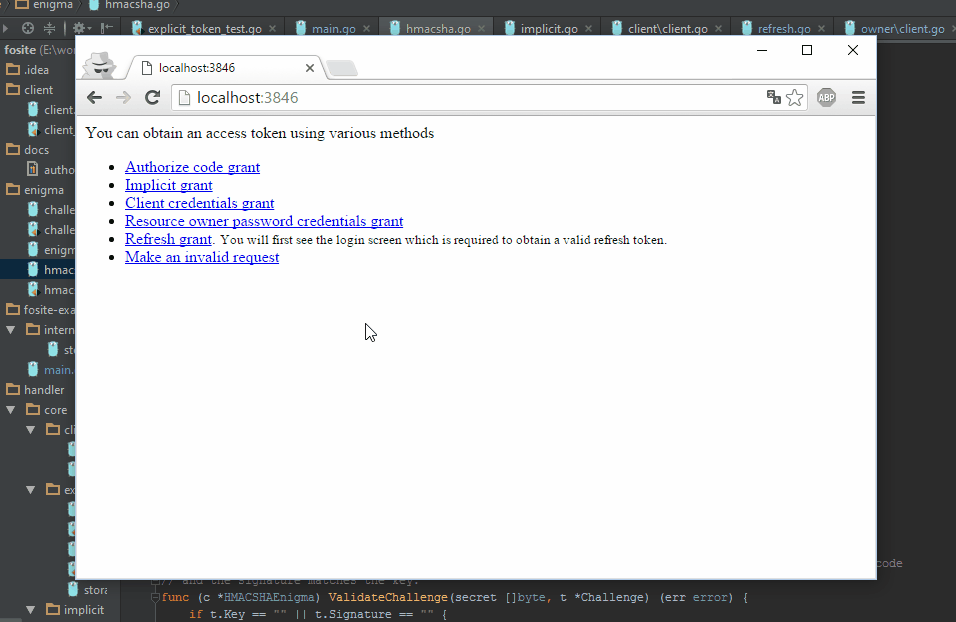

# 

**The security first OAuth2 & OpenID Connect framework for [Google's Go Language](https://golang.org).**
Built simple, powerful and extensible. This library implements peer-reviewed [IETF RFC6749](https://tools.ietf.org/html/rfc6749),
counterfeits weaknesses covered in peer-reviewed [IETF RFC6819](https://tools.ietf.org/html/rfc6819) and countermeasures various database
attack scenarios, keeping your application safe when that hacker penetrates or leaks your database. OpenID Connect is
implemented according to [OpenID Connect Core 1.0 incorporating errata set 1](openid.net/specs/openid-connect-core-1_0.html) and
includes all flows: code, implicit, hybrid.


[](https://travis-ci.org/ory-am/fosite?branch=master)
[](https://coveralls.io/github/ory-am/fosite?branch=master)
[](https://goreportcard.com/report/ory-am/fosite)

Be aware that `go get github.com/ory-am/fosite` will give you the master branch, which is and always will be *nightly*.
Once releases roll out, you will be able to fetch a specific [fosite API version through gopkg.in](#installation).
As of now, no stable `v1` version exists.

During development, we reviewed the following open specifications:
* [OAuth 2.0 Multiple Response Type Encoding Practices](https://openid.net/specs/oauth-v2-multiple-response-types-1_0.html)
* [OpenID Connect Core 1.0](https://openid.net/specs/openid-connect-core-1_0.html)
* [The OAuth 2.0 Authorization Framework](https://tools.ietf.org/html/rfc6749)
* [OAuth 2.0 Threat Model and Security Considerations](https://tools.ietf.org/html/rfc6819)
* [OpenID Connect Core 1.0 incorporating errata set 1](openid.net/specs/openid-connect-core-1_0.html)

<!-- START doctoc generated TOC please keep comment here to allow auto update -->
<!-- DON'T EDIT THIS SECTION, INSTEAD RE-RUN doctoc TO UPDATE -->
**Table of Contents**

- [Motivation](#motivation)
- [Example](#example)
- [A word on quality](#a-word-on-quality)
- [A word on security](#a-word-on-security)
- [A word on extensibility](#a-word-on-extensibility)
- [Usage](#usage)
  - [Installation](#installation)
- [Examples](#examples)
  - [Exemplary Storage Implementation](#exemplary-storage-implementation)
  - [Extensible handlers](#extensible-handlers)
- [Develop fosite](#develop-fosite)
  - [Useful commands](#useful-commands)
- [Known Limitations and Issues](#known-limitations-and-issues)
- [Hall of Fame](#hall-of-fame)

<!-- END doctoc generated TOC please keep comment here to allow auto update -->

## Motivation

Fosite was written because our OAuth2 and OpenID Connect service [**Hydra**](https://github.com/ory-am/hydra)
required a secure and extensible OAuth2 library. We had to realize that nothing matching our requirements
was out there, so we decided to build it ourselves.

## Example

The example does not have nice visuals but it should give you an idea of what you can do with Fosite and a few lines
of code.



You can run this minimalistic example by doing

```
go get github.com/ory-am/fosite/fosite-example
go install github.com/ory-am/fosite/fosite-example
fosite-example
```

There should be a server listening on [localhost:3846](https://localhost:3846/). You can check out the example's
source code [here](fosite-example/main.go).

## A word on quality

We tried to set up as many tests as possible and test for as many cases covered in the RFCs as possible. But we are only
human. Please, feel free to add tests for the various cases defined in the OAuth2 RFCs 6749 and 6819 or any other cases that improve the tests.

**Everyone** writing an RFC conform test that breaks with the current implementation, will receive a place in the
[Hall of Fame](#hall-of-fame)!

## A word on security

Please be aware that Fosite only secures parts your server side security. You still need to secure your apps and clients, keep
your tokens safe, prevent CSRF attacks, ensure database security, use valid and strong TLS certificates and much more. If you need any help or advice feel free to contact our security staff through [our website](https://ory.am/)!

We have given the various specifications, especially [OAuth 2.0 Threat Model and Security Considerations](https://tools.ietf.org/html/rfc6819#section-5.1.5.3),
a very close look and included everything we thought was in the scope of this framework. Here is a complete list
of things we implemented in Fosite:

* [No Cleartext Storage of Credentials](https://tools.ietf.org/html/rfc6819#section-5.1.4.1.3)
* [Encryption of Credentials](https://tools.ietf.org/html/rfc6819#section-5.1.4.1.4)
* [Use Short Expiration Time](https://tools.ietf.org/html/rfc6819#section-5.1.5.3)
* [Limit Number of Usages or One-Time Usage](https://tools.ietf.org/html/rfc6819#section-5.1.5.4)
* [Bind Token to Client id](https://tools.ietf.org/html/rfc6819#section-5.1.5.8)
* [Automatic Revocation of Derived Tokens If Abuse Is Detected](https://tools.ietf.org/html/rfc6819#section-5.2.1.1)
* [Binding of Refresh Token to "client_id"](https://tools.ietf.org/html/rfc6819#section-5.2.2.2)
* [Refresh Token Rotation](https://tools.ietf.org/html/rfc6819#section-5.2.2.3)
* [Revocation of Refresh Tokens](https://tools.ietf.org/html/rfc6819#section-5.2.2.4)
* [Validate Pre-Registered "redirect_uri"](https://tools.ietf.org/html/rfc6819#section-5.2.3.5)
* [Binding of Authorization "code" to "client_id"](https://tools.ietf.org/html/rfc6819#section-5.2.4.4)
* [Binding of Authorization "code" to "redirect_uri"](https://tools.ietf.org/html/rfc6819#section-5.2.4.6)
* [Opaque access tokens](https://tools.ietf.org/html/rfc6749#section-1.4)
* [Opaque refresh tokens](https://tools.ietf.org/html/rfc6749#section-1.5)
* [Ensure Confidentiality of Requests](https://tools.ietf.org/html/rfc6819#section-5.1.1)
* [Use of Asymmetric Cryptography](https://tools.ietf.org/html/rfc6819#section-5.1.4.1.5)
  Fosite ensures that redirect URIs use https **except localhost** but you need to implement
  TLS for the token and auth endpoints yourself.

Additionally, we added these safeguards:
* **Enforcing random states:** Without a random-looking state or OpenID Connect nonce the request will fail.
* **Advanced Token Validation:** Tokens are layouted as `<key>.<signature>` where `<signature>` is created using HMAC-SHA256
 using a global secret.
  This is what a token can look like:
  `/tgBeUhWlAT8tM8Bhmnx+Amf8rOYOUhrDi3pGzmjP7c=.BiV/Yhma+5moTP46anxMT6cWW8gz5R5vpC9RbpwSDdM=`
* **Enforging scopes:** By default, you always need to include the `fosite` scope or fosite will not execute the request
  properly. Obviously, you can change the scope to `basic` or `core` but be aware that you should use scopes if you use
  OAuth2.

Sections below [Section 5](https://tools.ietf.org/html/rfc6819#section-5)
that are not covered in the list above should be reviewed by you. If you think that a specific section should be something
that is covered in Fosite, feel free to create an [issue](https://github.com/ory-am/fosite/issues). Please be
aware that OpenID Connect requires specific knowledge of the identity provider, which is why Fosite only implements core
requirements and most things must be implemented by you (for example prompt, max_age, ui_locales, id_token_hint, user authentication, session management, ...).

**It is strongly encouraged to use the handlers shipped with Fosite as they follow the specs and are well tested.**

## A word on extensibility

Fosite is extensible ... because OAuth2 is an extensible and flexible **framework**.
Fosite let's you register custom token and authorize endpoint handlers with the security that the requests
have been validated against the OAuth2 specs beforehand.
You can easily extend Fosite's capabilities. For example, if you want to provide OpenID Connect on top of your
OAuth2 stack, that's no problem. Or custom assertions, what ever you like and as long as it is secure. ;)

## Usage

There is an API documentation available at [godoc.org/ory-am/fosite](https://godoc.org/github.com/ory-am/fosite).

### Installation

You will need [Go](https://golang.org) installed on your machine and it is required that you have set up your
GOPATH environment variable. Fosite is being shipped through gopkg.in so new updates don't break your code.
To see a full list of available versions check [gopkg.in/ory-am/fosite.v0](https://gopkg.in/ory-am/fosite.v0).

Right now, there is only an unstable release versioned as the v0 branch:

```
go get gopkg.in/ory-am/fosite.v0
```

## Examples

Take a look at these real-life implementations:
* [Integration tests](integration/)
* [Request validation](integration/helper_endpoints_test.go) (check `func tokenInfoHandler`)
* [Fully functional example app with all OpenID Connect and OAuth2 flows enabled](fosite-example/main.go)

### Exemplary Storage Implementation

Fosite does not ship a storage implementation yet. To get fosite running, you need to implement `github.com/ory-am/fosite.Storage`.
Additionally, most of the token / authorize endpoint handlers require a dedicated store implementation as well. You could however use one struct
to implement all the signatures.

You can find a working store implementation at [fosite-example/internal/store.go](fosite-example/internal/store.go).

### Extensible handlers

You can replace the Token and Authorize endpoint logic by modifying `Fosite.TokenEndpointHandlers` and
`Fosite.AuthorizeEndpointHandlers`.

Let's take the explicit authorize handler. He is responsible for handling the
[authorize code workflow](https://aaronparecki.com/articles/2012/07/29/1/oauth2-simplified#web-server-apps).

If you want to enable the handler able to handle this workflow, you can do this:

```go
var hmacStrategy = &strategy.HMACSHAStrategy{
	Enigma: &enigma.Enigma{
		GlobalSecret: []byte("some-super-cool-secret-that-nobody-knows"),
	},
}

// var store = ...

f := NewFosite(store)
accessTokenLifespan := time.Hour

// Let's enable the explicit authorize code grant!
explicitHandler := &explicit.AuthorizeExplicitGrantTypeHandler{
    AccessTokenStrategy:   hmacStrategy,
    RefreshTokenStrategy:  hmacStrategy,
    AuthorizeCodeStrategy: hmacStrategy,
    Store:               store,
    AuthCodeLifespan:    time.Minute * 10,
    AccessTokenLifespan: accessTokenLifespan,
}

// Please note that order matters!
f.AuthorizeEndpointHandlers.Append(explicitHandler)
f.TokenEndpointHandlers.Append(explicitHandler)
```

As you probably noticed, there are two types of handlers, one for the [authorization */auth* endpoint](https://tools.ietf.org/html/rfc6749#section-3.1) and one for the [token
*/token* endpoint](https://tools.ietf.org/html/rfc6749#section-3.2). The `AuthorizeExplicitEndpointHandler` implements
API requirements for both endpoints, while, for example, the `AuthorizeImplicitEndpointHandler` only implements
the `AuthorizeEndpointHandler` API.

You can find a complete list of handlers inside the [handler directory](handler). A short list is documented here:

* `github.com/ory-am/fosite/handler/core/explicit.AuthorizeExplicitEndpointHandler` implements the
  [Authorization Code Grant](https://tools.ietf.org/html/rfc6749#section-4.1)
* `github.com/ory-am/fosite/handler/core/implicit.AuthorizeImplicitEndpointHandler` implements the
  [Implicit Grant](https://tools.ietf.org/html/rfc6749#section-4.2)
* `github.com/ory-am/fosite/handler/core/token/owner.TokenROPasswordCredentialsEndpointHandler` implements the
  [Resource Owner Password Credentials Grant](https://tools.ietf.org/html/rfc6749#section-4.3)
* `github.com/ory-am/fosite/handler/core/token/client.TokenClientCredentialsEndpointHandler` implements the
  [Client Credentials Grant](https://tools.ietf.org/html/rfc6749#section-4.4)

## Develop fosite

You need git and golang installed on your system.

```
go get github.com/ory-am/fosite -d
cd $GOPATH/src/ github.com/ory-am/fosite
git status
git remote add myfork <url-to-your-fork>
go test ./...
```

Simple, right? Now you are ready to go! Make sure to run `go test ./...` often, detecting problems with your code
rather sooner than later.

### Useful commands

**Create storage mocks**
```sh
mockgen -package internal -destination internal/storage.go github.com/ory-am/fosite Storage
mockgen -package internal -destination internal/authorize_code_storage.go github.com/ory-am/fosite/handler/core AuthorizeCodeStorage
mockgen -package internal -destination internal/access_token_storage.go github.com/ory-am/fosite/handler/core AccessTokenStorage
mockgen -package internal -destination internal/refresh_token_strategy.go github.com/ory-am/fosite/handler/core RefreshTokenStorage
mockgen -package internal -destination internal/core_client_storage.go github.com/ory-am/fosite/handler/core/client ClientCredentialsGrantStorage
mockgen -package internal -destination internal/core_explicit_storage.go github.com/ory-am/fosite/handler/core/explicit AuthorizeCodeGrantStorage
mockgen -package internal -destination internal/core_implicit_storage.go github.com/ory-am/fosite/handler/core/implicit ImplicitGrantStorage
mockgen -package internal -destination internal/core_owner_storage.go github.com/ory-am/fosite/handler/core/owner ResourceOwnerPasswordCredentialsGrantStorage
mockgen -package internal -destination internal/core_refresh_storage.go github.com/ory-am/fosite/handler/core/refresh RefreshTokenGrantStorage
mockgen -package internal -destination internal/oidc_id_token_storage.go github.com/ory-am/fosite/handler/oidc OpenIDConnectRequestStorage
```

**Create strategy mocks**
```sh
mockgen -package internal -destination internal/access_token_strategy.go github.com/ory-am/fosite/handler/core AccessTokenStrategy
mockgen -package internal -destination internal/refresh_token_strategy.go github.com/ory-am/fosite/handler/core RefreshTokenStrategy
mockgen -package internal -destination internal/authorize_code_strategy.go github.com/ory-am/fosite/handler/core AuthorizeCodeStrategy
mockgen -package internal -destination internal/id_token_strategy.go github.com/ory-am/fosite/handler/oidc OpenIDConnectTokenStrategy
```

**Create handler mocks**
```sh
mockgen -package internal -destination internal/authorize_handler.go github.com/ory-am/fosite AuthorizeEndpointHandler
mockgen -package internal -destination internal/token_handler.go github.com/ory-am/fosite TokenEndpointHandler
mockgen -package internal -destination internal/validator.go github.com/ory-am/fosite AuthorizedRequestValidator
```

**Create stateful "context" mocks**
```sh
mockgen -package internal -destination internal/client.go github.com/ory-am/fosite/client Client
mockgen -package internal -destination internal/request.go github.com/ory-am/fosite Requester
mockgen -package internal -destination internal/access_request.go github.com/ory-am/fosite AccessRequester
mockgen -package internal -destination internal/access_response.go github.com/ory-am/fosite AccessResponder
mockgen -package internal -destination internal/authorize_request.go github.com/ory-am/fosite AuthorizeRequester
mockgen -package internal -destination internal/authorize_response.go github.com/ory-am/fosite AuthorizeResponder
```

## Known Limitations and Issues

* Validator handler receives empty Request object

## Hall of Fame

This place is reserved for the fearless bug hunters, reviewers and contributors (alphabetical order).

* [agtorre](https://github.com/agtorre):
  [contributions](https://github.com/ory-am/fosite/issues?q=author%3Aagtorre),
  [participations](https://github.com/ory-am/fosite/issues?q=commenter%3Aagtorre).
* [danielchatfield](https://github.com/danielchatfield):
  [contributions](https://github.com/ory-am/fosite/issues?q=author%3Adanielchatfield),
  [participations](https://github.com/ory-am/fosite/issues?q=commenter%3Adanielchatfield).
* [leetal](https://github.com/leetal):
  [contributions](https://github.com/ory-am/fosite/issues?q=author%3Aleetal),
  [participations](https://github.com/ory-am/fosite/issues?q=commenter%3Aleetal).

Find out more about the [author](https://aeneas.io/) of Fosite and Hydra, and the
[Ory Company](https://ory.am/).
